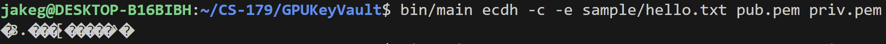
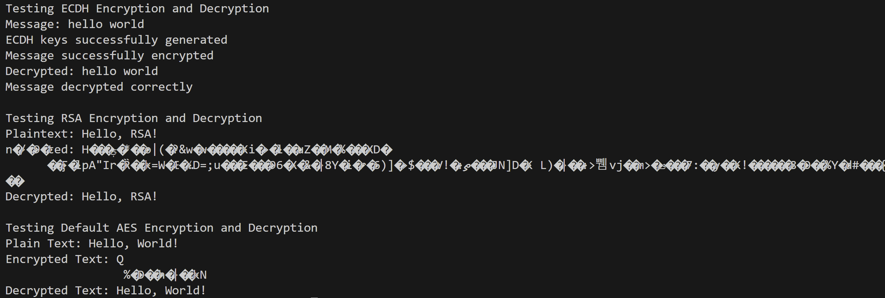
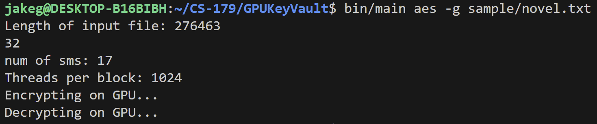

# GPUKeyVault

An implementation of PGP software using the GPU. Developed by Aditi Chandrashekar, Saumya Chauhan, and Jake Goldman for Caltech's CS 179: GPU Programming course. GPUKeyVault uses RSA and ECDH algorithms with both CPU and GPU technologies for encryption, decryption, and key generation. 

## Build Instructions ##

Install the necessary dependencies for GPUKeyVault, including OpenSSL. 

`make install`

## Usage Instructions ##

Compile the necessary binaries to build the GPUKeyVault application.

`make build`

This generates a bianry executable `bin/main` containing the GPUKeyVault application. Running this application with no options will display the help menu, which can also be displayed with the `-h` flag. The general format of execution follows as: 

### CPU ###

`bin/main [encryption mode] [-c] [-e FILE|-d FILE|-n] [PUB-KEY] [PRIV-KEY]`

### GPU ###

`bin/main [encryption mode] [-g] [FILE]`

## Examples ## 

### CPU Process ###

A basic usage example could include generating an ECDH key pair on the CPU, then using the pair encrypt and decrypt text. To generate the pairs:

`bin/main ecdh -c -n pub.pem priv.pem`

This generates a public key (public-keys/pub.pem) and private key (private-keys/priv.pem). Our *sample* directory contains a simple hello.txt for testing encryption and decryption. With our newly generated keys, to encrypt the hello.txt file:

`bin/main ecdh -c -e sample/hello.txt pub.pem priv.pem`

This generates encrypted text that is passed into stdout. This feature will be adapted to pass the output into a message file in the standard PGP form. Assuming this output text is stored in the encrypted file, we can decrypt it using 

`bin/main ecdh -c -d encrypted pub.pem priv.pem`

For further examples of usage, the `make test` target will execute predefined test cases for ECDH and RSA encryption on the CPU. The testing suite is located in the test/tester.cpp file. A series of repeated executions for timing purposes can be run with the `make time` target. 

### GPU Process ###

Key generation to local storage proved to be a challenge due to existing key generation libaries not being fit for the GPU. So, our GPU PGP model completes the encryption and decryption in a single execution session. For example, the GPU RSA implementation can be run as follows:

`bin/main rsa -g sample/novel.txt`

To use AES encryption instead:

`bin/main aes -g sample/novel.txt`

Both of the above commands will populate the encrypted and decrypted text files, with the decrypted text matching the original. 

## Performance Analysis

We defined a testing suite comparing RSA key generation, encryption, and decryption between the CPU and GPU. Since RSA was the only method shared between both the CPU and GPU, we chose this as our sample to time. Since the GPU implementation of RSA doesn't store keys in files, we can't break it into components and must run the entire program at once. For timing, we compared the average speed of the key generation, encryption, and decryption process using the novel.txt sample file. 

```
CPU keygen:     357320 µs
CPU encryption:     39 µs
CPU decryption:   4401 µs
=========================
CPU total:      361760 µs
GPU total:      223060 µs
```

Taking the average of 100 runs, the GPU implementation saw a **38.3%** time improvement for RSA. Part of this improvement, however, may be attributed to not saving the keys to storage and only keeping it in the runtime's memory. But, since a lot of the calculations were parallelized with encryption and decryption, we can still reason that a portion of the speedup can be attributed to these improvements. 

## Screenshots ##

### Sample Encryption ###


### Successful Testing Output ###


### Successful GPU Processing ###
